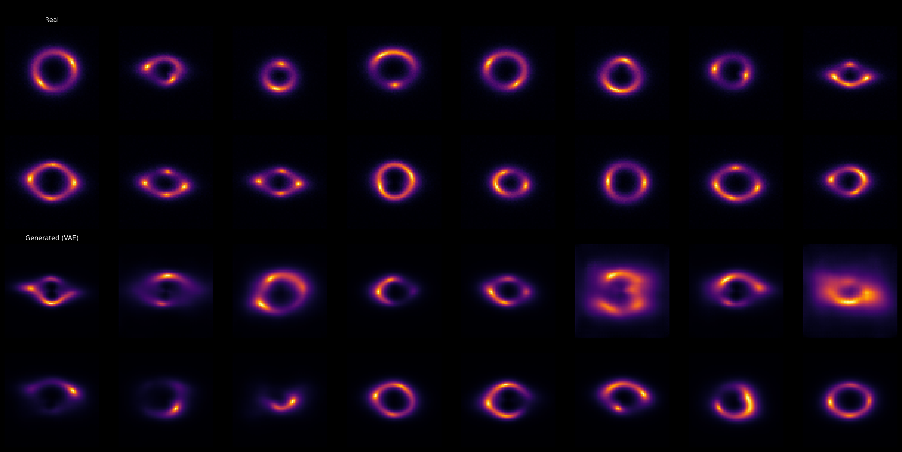
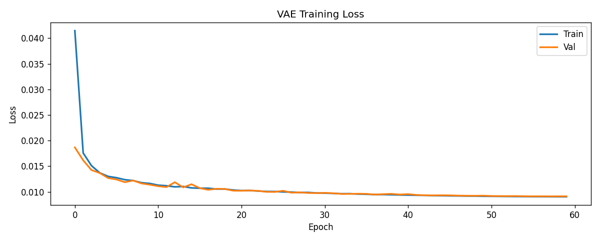
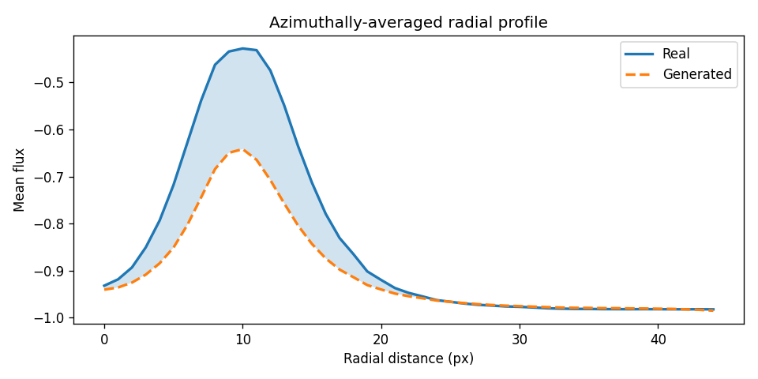
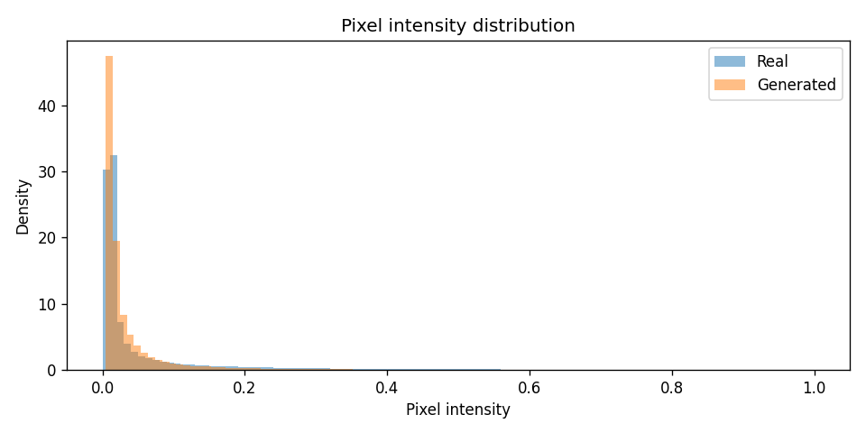

# Variational Autoencoder for Strong Gravitational Lensing

This project features a fast and efficient implementation of a Variational Autoencoder (VAE) designed to model and generate images of strong gravitational lensing systems. Built in PyTorch, it generates synthetic lensing images and evaluates them against real samples using both computer vision and domain-specific physics metrics.

## Overview

The VAE architecture compresses 64x64 single-channel (grayscale) images into a 128-dimensional latent space. It uses ResNet-style blocks (`ResBlock`) with Group Normalization and SiLU activations for robust feature extraction and high-quality image reconstruction. The loss function utilizes an L1 reconstruction loss combined with Kullback-Leibler (KL) divergence, tailored to produce sharper generated images compared to standard MSE loss. 

## Key Features

- **Custom Dataloader (`LensingDataset`)**: Loads and preprocesses `.npy` image arrays, automatically handling resizing (to 64x64) and symmetric normalization `[-1, 1]`.
- **Advanced VAE Architecture**:
  - **Encoder**: Compresses input lenses using convolutional layers and ResBlocks into a multi-dimensional latent space representation (`mu` and `log_var`).
  - **Decoder**: Reconstructs realistic lensing images from the sampled latent vectors using deterministic upsampling and transposed convolutions.
- **Optimized Training**: Built-in support for PyTorch Automatic Mixed Precision (AMP) and Cosine Annealing learning rate scheduling for rapid convergence on GPU (`nvidiaTeslaT4` optimized but hardware-agnostic).
- **Comprehensive Evaluation**:
  - **Physics Metrics**: Computes **Radial Profile RMSE** and **Power Spectrum RMSE** to quantitatively compare the physical realism of the generated samples against real astronomical data.
  - **FID Score**: Uses Fréchet Inception Distance to evaluate the perceptual quality of the generated distributions.
- **Automated Visualization**: Generates loss curves, real vs. generated image grids, radial profile plots, and pixel intensity histograms.

## Requirements

Ensure you have the following libraries installed:
- `torch` and `torchvision`
- `numpy`
- `matplotlib`
- `scipy`
- `tqdm`

## Usage

You can run the model directly inside a Jupyter-compatible environment like Kaggle or a local Jupyter Notebook server:

1. Open `vae_lensing_fast.ipynb`.
2. Configure the `DATA_DIR` variable in the notebook to point to your root directory containing the `.npy` files of gravitational lenses.
3. Run all cells. The notebook will automatically train the model and save the best checkpoints.

## Outputs and Checkpoints

Output assets are generated and saved to the configured paths (`vae_outputs/` directory by default).

### Quantitative Results
After training for 60 epochs (Latent Dim: 128), the Variational Autoencoder achieved the following metrics on the evaluation set (256 samples):
- **Best Validation Loss:** 0.0091
- **Fréchet Inception Distance (FID):** 76.57
- **Radial Profile RMSE:** 0.1110
- **Power Spectrum RMSE:** 0.9085

### Qualitative Results

#### Real vs. Generated Comparison
A visual comparison of actual dataset lenses versus the VAE-generated lenses.

#### Training Consistency
Training and validation loss progression over 60 epochs.

#### Statistical Distributions
Plots matching the physical and statistical distributions of real and fake images.

*Additional individual generated images and grids are saved in the `vae_outputs/` directory and `vae_outputs/generated_individual/`.*
